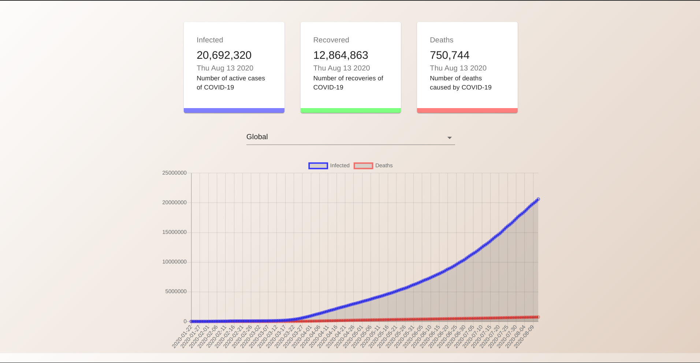

# Covid-19 Monitoring App
### Based on a [tutorial](https://www.youtube.com/watch?v=khJlrj3Y6Ls) by JavaScript Mastery

Displays Number of infected, death, and recovered cases globally and in each country. Additionally, it displays the growth of the death and infected cases using [chartjs](https://www.chartjs.org/)

Built with react and [Covid-19 API](https://covid19.mathdro.id/api)

